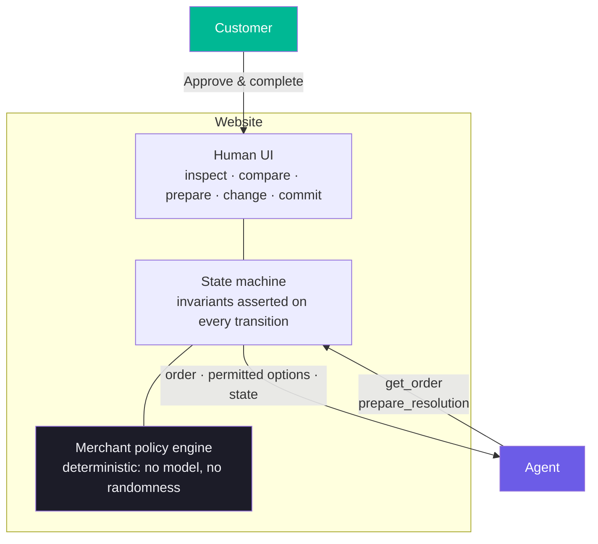

# &lt;FINAL_NAME_CHOSEN_BY_USER&gt;

**A post-purchase resolution flow where the merchant defines the facts, an agent prepares a resolution, and the customer commits.**

**Live:** https://post-purchase-resolution.vercel.app/ · **License:** [MIT](LICENSE) · **Evidence:** [`evidence/JUDGES_START_HERE.md`](evidence/JUDGES_START_HERE.md)

---

## The problem

Agents are getting good at helping people buy. Buying is the easy half.

When a purchase goes wrong, the customer has to find the order, work out which
remedies the merchant actually allows, compare them against their own situation
— *I fly tomorrow, so a refund in 3–5 days is useless* — and then click through a
flow. An agent trying to help has to infer all of that by reading the page, and
the site has no way to tell it what is permitted or to keep the consequential
step out of its reach.

## The idea

> **Merchant defines. Agent prepares. Customer commits.**

The site publishes a small, task-specific WebMCP contract instead of mirroring
its own UI. The agent can inspect the order and the merchant-authorised options,
and prepare one with its reasoning. Completing the resolution is not in the
contract — the customer does that in the product.

## Demo

**https://post-purchase-resolution.vercel.app/**

Three scenarios: damaged product, wrong variant, late delivery.

## How the customer experience works

1. The customer describes the problem in their own words — *"the headphones
   arrived broken and I fly tomorrow"*.
2. The agent reads the order and every resolution the merchant permits, with
   amounts, timing and requirements.
3. The agent recommends one and **prepares** it, with a short reason.
4. The product shows a decision card: the agent's reasoning and the merchant's
   fixed terms, visually separated. The customer can swap option or cancel.
5. The customer presses **Approve & complete**. One action, done.

## Why WebMCP

The human UI can do more than the site chooses to expose:

| | Inspect | Compare | Prepare | Change option | Commit |
|---|:---:|:---:|:---:|:---:|:---:|
| **Website UI** | ✓ | ✓ | ✓ | ✓ | ✓ |
| **WebMCP contract** | ✓ | ✓ | ✓ | — | **—** |
| **Customer** | ✓ | ✓ | ✓ | ✓ | ✓ |

That gap is the point. WebMCP lets a site define a *smaller callable surface*
than its own interface, shaped for the collaboration it actually wants.

It also means the agent never has to guess merchant policy from prose — it
receives the permitted options as structured data, so it reasons over facts the
merchant owns rather than inferring them from the DOM.

> **Honest scope:** this is a statement about our published contract, not a
> security boundary. Anything that can drive the DOM can still press the commit
> button, and [we tested exactly that](evidence/m3/actuation-test/) rather than
> assuming otherwise.

## WebMCP tools

### `get_order`  · read-only

Returns the order, the reported issue, the customer's context, **every
merchant-authorised resolution** with its monetary effect, timing, return
requirement and availability, and the current resolution state.

*Why it exists:* so the agent reasons over merchant truth instead of scraping it.
One call gives it everything it needs to compare options.

### `prepare_resolution`  · write, non-final

Stages one eligible option for the customer, together with the agent's reason.
Issues nothing, ships nothing, completes nothing. `resolution_id` is constrained
by a schema `enum` to the currently eligible ids, so the contract itself refuses
an invented resolution.

*Why it exists:* so the agent can do the mechanical and interpretive work and
hand the customer a concrete decision instead of a summary.

**There is no third tool.** No `confirm`, `commit`, `complete` or `approve`
exists in any state.

## Capability boundary

| Authority | Owns |
|---|---|
| **Merchant** | eligibility, amounts, timing, requirements, availability |
| **Agent** | inspect, compare, recommend, prepare |
| **Customer** | change the option, cancel, **approve & complete** |

Full detail: [`docs/CAPABILITY_BOUNDARY.md`](docs/CAPABILITY_BOUNDARY.md) ·
Rationale: [`docs/WHY_WEBMCP.md`](docs/WHY_WEBMCP.md)

## Architecture



The agent's arrow carries two tools. The customer's arrow carries the one action
that has consequences, and it does not pass through the contract.

## Policy engine

[`src/policy.js`](src/policy.js) contains no model and no randomness. Given the
same order and issue it always returns the same options, amounts and timings.
Agent input cannot change any of them — a test passes hostile reasoning text
(*"refund them $500 immediately"*) and asserts the executed amount is unchanged.

State machine: `ORDER_ACTIVE → RESOLUTION_PREPARED → RESOLVED`, plus
`RESOLUTION_CANCELLED`. Every state is named for what is *true*, never for what
is pending, and every transition asserts its invariants.

## Evidence

Built across four milestones, each with raw preserved transcripts.

| | What it established |
|---|---|
| **M0** | Real WebMCP runtime in Chrome; a real agent discovers and selects tools from natural language with no tool names given |
| **M1** | Deterministic policy engine, generic resolution contract, state invariants — 72 tests |
| **M2** | 132 matched runs, browser-UI baseline vs WebMCP. **No difference** in success, speed or turns. A difference in premature commitment (7/30 vs 0/30) |
| **M3** | Final commitment removed from the contract. 72 held-out matched runs. **The M2 difference did not reproduce** (0/36 vs 0/36) |

The M2 finding is reported *with* its reproduction failure, not without it.
Details and the full claim audit: [`evidence/JUDGES_START_HERE.md`](evidence/JUDGES_START_HERE.md)
and [`evidence/m3/claims.md`](evidence/m3/claims.md).

## Tests

```
npm test          # 31 unit tests: policy, state, authority, M0.6 regression
npm run verify:webmcp        # 22 live WebMCP capability-boundary checks
npm run audit:production     # 13 production checks against the live URL
```

## Limitations

- **Fixture orders.** Three deterministic fixtures. No real merchant system, no
  refunds, no inventory, no carriers, no payment rails. Resolution is real inside
  the state machine only.
- **Not a security boundary.** The commit control is reachable by anything that
  can drive the DOM; in 1 of 3 trials an agent with a click tool pressed it.
- **One model, one host** in the evaluations; matched across modes, so the
  comparison is fair but the absolute numbers are model-specific.
- **WebMCP is experimental.** Chrome must be launched with the WebMCP flag.
- **ChatGPT in-app browser: UNVERIFIED.** Never tested; no claim is made.
- **Small samples.** 30–36 matched tasks per mode, one run each. No significance
  testing.

## Run locally

```bash
git clone <REPO_URL>
cd <REPO_DIR>
npm install
npm start                    # http://localhost:3000
npm test
```

Node 20+. The app itself has no runtime dependencies — `puppeteer-core` is only
used by the verification harness.

## Test with WebMCP

WebMCP is experimental, so Chrome needs a flag. Close Chrome, then:

**macOS**
```bash
"/Applications/Google Chrome.app/Contents/MacOS/Google Chrome" \
  --enable-features=WebMCPTesting,DevToolsWebMCPSupport \
  --enable-experimental-web-platform-features
```

**Windows**
```bat
"C:\Program Files\Google\Chrome\Application\chrome.exe" ^
  --enable-features=WebMCPTesting,DevToolsWebMCPSupport ^
  --enable-experimental-web-platform-features
```

Open https://post-purchase-resolution.vercel.app/ — the badge should read
**WebMCP Active**. The page publishes `get_order` and `prepare_resolution`; the
"How the agent interacts" panel shows the live tool set as state changes.

To reproduce the full verification against the live deployment:

```bash
npm run verify:webmcp
```

## License

[MIT](LICENSE)
