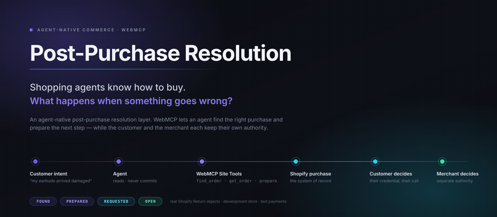
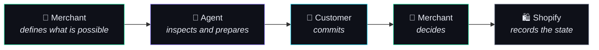
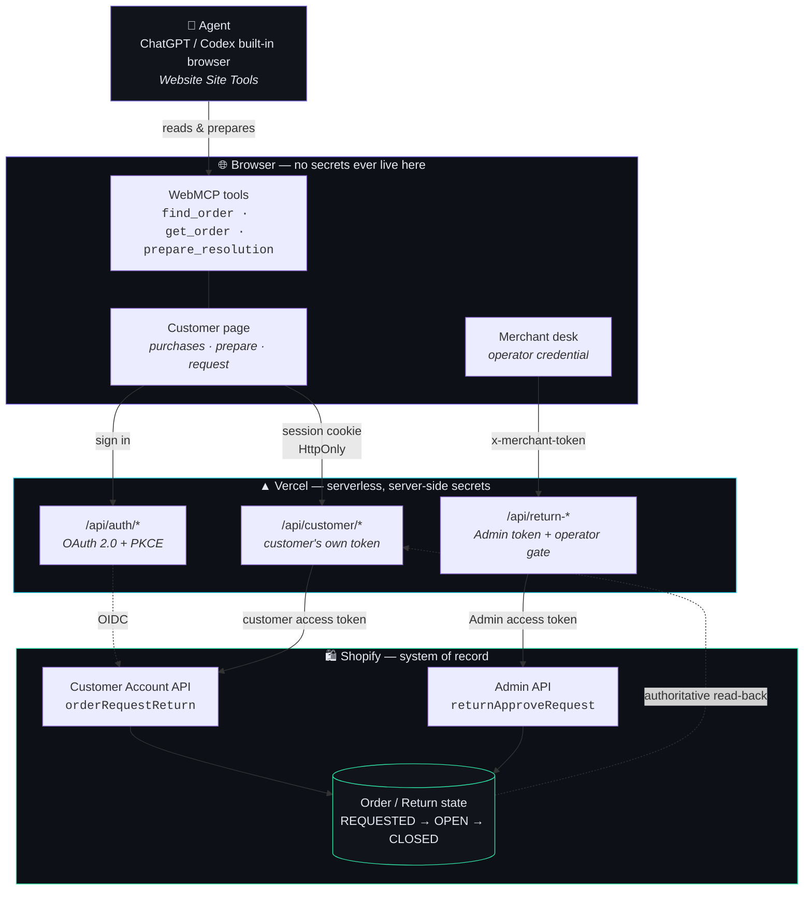

<p align="center">
  
</p>

<p align="center">
  <a href="https://post-purchase-resolution.vercel.app/"></a>
  
  
  
  
  
  <a href="LICENSE"></a>
</p>

<p align="center">
  <b><a href="https://post-purchase-resolution.vercel.app/">Live product</a></b> ·
  <a href="#architecture">Architecture</a> ·
  <a href="#evidence-not-claims">Evidence</a> ·
  <a href="#run-locally">Run locally</a> ·
  <a href="docs/CHATGPT_SITE_TOOLS.md">Try it in ChatGPT</a>
</p>

---

When a purchase goes wrong, people shouldn't have to dig up an order number,
decode a return policy and fight a support menu. Their agent should find the
purchase, understand what the merchant actually allows, and get the next step
ready — **without quietly becoming the customer or the merchant.**

That last clause is the whole design.

---

## The 30-second version

A shopping agent can buy something for you today. The moment it arrives broken,
the agent falls off a cliff: it has no idea which purchase you mean, what the
merchant's policy says, or what it is allowed to do about it.

This project is the missing layer. A website publishes three WebMCP tools, and
an agent can:

- **find** the right purchase from a plain description — no order number,
- **read** authoritative eligibility straight from Shopify,
- **prepare** a resolution for the person to look at.

And then it stops, because there is nothing else for it to call. Submitting the
return is the customer's action, taken with the customer's own credential.
Approving it is the merchant's, taken with theirs.

> **A real, spoken sentence — "the earbuds I bought recently arrived damaged, the
> left side doesn't work" — was enough for ChatGPT to find order `#1005`, read
> that it was delivered and eligible for return, and explain the options.
> No order number was given. No return was created.**

---

## What people and agents do together

<table>
<tr>
<th align="left" width="25%">🤖 Agent</th>
<th align="left" width="25%">🧑 Customer</th>
<th align="left" width="25%">🏪 Merchant</th>
<th align="left" width="25%">🛍 Shopify</th>
</tr>
<tr valign="top">
<td>

Finds the relevant purchase

Reads authoritative eligibility

Prepares a resolution

**Cannot commit — there is no
WebMCP tool that commits**

</td>
<td>

Authenticates with Shopify

Owns the purchase scope

Explicitly requests the return,
under their **own** access token

</td>
<td>

Sees pending requests

Explicitly approves

Retains merchant authority
via the Admin API

</td>
<td>

System of record

`REQUESTED` → `OPEN` → `CLOSED`

The truth both sides read back

</td>
</tr>
</table>

> **The agent can help. It cannot silently become the customer or the merchant.**

---

## Why WebMCP?

Without WebMCP, an agent facing this problem has to behave like a screen
scraper: look at a page, guess which DOM nodes mean something, click, re-read,
and hope the text it parsed meant what it looked like. Business meaning —
*is this actually returnable, and why not?* — is exactly what gets lost.

With WebMCP the site publishes what it can actually do, and the agent receives
structured facts instead of prose:

| | Without WebMCP | With WebMCP |
|---|---|---|
| Finding the purchase | scrape the order list, guess | `find_order` over the customer's own orders |
| Eligibility | parse policy text, infer | `returnable`, `returnableQuantity`, and *why not* |
| Doing something | click whatever looks like a button | `prepare_resolution` — and nothing that commits |
| Safety | hope the agent behaves | **the capability simply isn't published** |

The concrete difference, from the verification run:

The user said — out loud, in a brand-new chat with no prior context —

> *"The earbuds I bought recently arrived damaged. The left side doesn't work.
> Can you find the purchase and tell me what I can do? Don't submit anything."*

The agent enumerated the site's tools and came back with **Noise Cancelling
Earbuds, `#1005`, $119 USD, paid, fulfilled, eligible for return, no return
started.** It never saw an order number. It called `find_order` and `get_order`
— and *not* `prepare_resolution`, because the request asked only to find and
explain.

That last detail matters more than it looks: the agent picked tools according to
intent, and the one tool that would have staged something was left alone.

---

## The authority model



The WebMCP surface is **deliberately asymmetric**. These three tools exist:

`find_order` · `get_order` · `prepare_resolution`

These do not, in any state:

~~`request_return`~~ · ~~`approve_return`~~ · ~~`refund`~~ · ~~`complete_resolution`~~

**This is a design decision, not a missing feature.** A guarantee that rests on
an agent choosing to behave is not a guarantee. In an earlier milestone we
tested exactly that: given a page with a commit button, an agent pressed it in
1 of 3 trials. So the guarantee here is structural — the capability is not
published, so there is nothing to call, and a 22-check boundary suite re-asserts
that against the live deployment on every run.

---

## Proven with real Shopify objects

Verified against a **Shopify development store** using test orders and real
Shopify `Order` and `Return` objects. Test payments only — no real money, no
real customers, and no production merchant deployment.

### The full loop — order `#1004`, Smart Fitness Watch

| | |
|---|---|
| Discovery | order number **not** hardcoded anywhere in the product |
| Customer authority | Customer Account API → `orderRequestReturn` |
| Return created | `#1004-R1` → **`REQUESTED`** |
| Merchant authority | Admin API → `returnApproveRequest`, from the deployed desk |
| Same external Return | **yes** — id `57460621684` throughout |
| Final state | **`OPEN`** |
| Refund | **none** · duplicate Return: **none** |

Shopify's own event log carries the split, and it is the cleanest evidence in
the project:

```
15:40:39Z  app=true  user=false   WebMCP Resolution Connector   requested return #1004-R1
17:43:12Z  app=true  user=false   WebMCP Resolution Connector   approved  return #1004-R1
```

`attributedToUser=false` on both means neither transition was a person clicking
in Shopify Admin — each ran through the deployed application. Yet the two halves
used **different credentials**: the request under the customer's own Customer
Account API token, the approval under the Admin token behind an operator
credential.

### The agent boundary — order `#1005`, Noise Cancelling Earbuds

| | |
|---|---|
| User input | natural language, then a spoken request in a new chat |
| Order number supplied | **no** |
| Purchase found | Noise Cancelling Earbuds · `#1005` · $119 · paid · fulfilled · delivered · eligible |
| Tools used | `find_order`, `get_order`, `prepare_resolution` (typed) · `find_order`, `get_order` (spoken) |
| Agent mutation | **none** |
| Shopify Return afterwards | **none** |

The strongest part of that table is the last row, and it is an *absence with a
matching presence*. Shopify attributes every mutation this app performs to
`WebMCP Resolution Connector` — that is how `#1004-R1` was traced above. After
an agent read `#1005` and prepared a resolution against it, that order has **zero
events attributed to this application, and no return at all.**

---

## Real scenarios tested

**Damaged earbuds** — *"The earbuds I bought recently arrived damaged. The left
side doesn't work."* The agent found the right order with no order number, read
eligibility from Shopify, and stopped without submitting.

**Smart fitness watch** — a fresh order, auto-discovered. Customer requested,
Shopify recorded `REQUESTED`, the merchant approved from the desk, the same
Return became `OPEN`.

**Portable bluetooth speaker** — a return that had already been refunded and
closed. The customer page was showing a stale `OPEN`; the lifecycle bug was found
and fixed, and it now reads **Return completed · Your refund has been issued**,
with `CLOSED` as secondary detail.

Three orders, three different points in the return lifecycle. These are
existence proofs that the flow works end to end — **not** a reliability rate.
No success percentage is claimed anywhere in this repository.

---

## Architecture



Three things this diagram is careful about, because they are the security
properties:

- **No Admin secret is reachable from the browser.** The Admin token lives only
  in serverless functions under `api/`, and nothing in `src/` can import it.
- **The agent never touches a mutation route.** It reaches WebMCP tools only,
  and none of them mutate.
- **The customer never uses the merchant's token**, and the merchant never uses
  the customer's. Each mutation runs under the credential of whoever is actually
  deciding.

---

## WebMCP surface

Registered with `document.modelContext.registerTool()` and re-registered as
state changes, so the published surface always matches what is currently valid.

### `find_order`

Finds one of the signed-in customer's own purchases from how they describe it.

```js
inputSchema: {
  product_query:   'string',   // "headphones", "the watch"
  delivered_only:  'boolean',
  returnable_only: 'boolean',
  recency_days:    'integer',
}
```

There is deliberately **no** input for an order number, an order GID or a
customer id — nothing that could widen scope. The search runs server-side over
the orders Shopify exposes to the current session.

It resolves to exactly one of three outcomes, and **never guesses**:

```js
resolution: orders.length === 0 ? 'none'
          : orders.length === 1 ? 'single'
          : 'ambiguous',
note: 'More than one purchase matches. Ask the customer which one they mean; do not choose for them.'
```

### `get_order`

Reads the open purchase: product, amount, payment and delivery status, whether
items are still returnable, **why not** if they aren't, and any return already
raised. Every field comes from Shopify under the customer's own account.

It takes an optional `purchase_id` — but only one that `find_order` returned.
Resolution matches it against the customer's own order list rather than passing
it to Shopify, so a forged or borrowed id simply does not resolve:

```js
const found = orders.find(o => o.orderKey === String(orderKey));
if (!found) throw new CustomerError('ORDER_NOT_FOUND', 'That order is not in your account.');
```

### `prepare_resolution`

Stages a return for the customer to review. It contacts nothing and creates
nothing — a test isolates the method body and asserts it contains no `fetch`,
`XMLHttpRequest`, `sendBeacon` or `WebSocket`. It cannot reach the network at
all.

What it hands back is explicit about who still has to act:

```js
requiresCustomerRequest: true,
committedByCustomer: false,
nextStep: 'The customer submits this request themselves in the page. You cannot submit it for them.'
```

Full contract and rationale: [`docs/CAPABILITY_BOUNDARY.md`](docs/CAPABILITY_BOUNDARY.md).

---

## The authenticated customer

Purchases come from Shopify's **Customer Account API** under the customer's own
token — obtained through OAuth 2.0 with OIDC and **PKCE (S256)** as a public
client, with no client secret in the customer flow.

- Endpoints are **discovered**, never hardcoded (`.well-known/openid-configuration`,
  `.well-known/customer-account-api`).
- `state`, `nonce` and the PKCE verifier travel in an **AES-256-GCM sealed,
  `HttpOnly; Secure; SameSite=Lax` cookie** — the verifier never appears in a URL.
- The session cookie is opaque to browser JavaScript and tamper-evident.
- Scopes: `customer_read_customers`, `customer_read_orders`,
  `customer_write_customers`, alongside Admin `read_orders`, `read_returns`,
  `write_returns`.

**Order discovery operates only within the orders Shopify exposes to the
currently authenticated customer.** There is no arbitrary order enumeration and
no parameter that widens scope — `key`, `customerId`, an order GID and an order
number were each tested and each fails to reach anything.

Sign-out is RP-initiated against the discovered `end_session_endpoint`, so it
ends the session at Shopify rather than only dropping a local cookie.

---

## Security & authority boundaries

| Property | How |
|---|---|
| Customer authentication | OAuth 2.0 + OIDC + PKCE (S256), public client |
| Customer-scoped reads | every query runs under the customer's own token |
| No arbitrary order lookup | ids resolve against the customer's own list, never passed through |
| No Admin secret in the browser | Admin token exists only in `api/` serverless functions |
| No agent mutation | no completion tool is published in **any** state |
| Commerce mutations | `POST` only — `GET` returns `405` |
| Stale-state protection | authoritative re-read immediately before every mutation |
| Duplicate protection | an existing live return refuses a second request |
| Merchant approval | operator credential, constant-time compared, server-side |
| Invalid input | malformed bodies return `400`, never `500` |
| Public evidence | PII-minimised; no token, code, PKCE material or address |

**Stated plainly:** merchant access currently uses a shared **operator
credential**, not merchant identity or OAuth. It prevents anonymous approval —
anonymous *and* wrong-credential approvals both return `MERCHANT_UNAUTHORIZED` —
but it is **not production-grade merchant authentication**, and the desk says so
in the UI.

---

## Evidence, not claims

Every claim above follows the same path:

> **claim → test → external system → raw evidence file**

Nothing is asserted from application memory. Where state is claimed, it is
re-read from Shopify by a process with no connection to the page or the session
that produced it.

| Suite | Result | Scope |
|---|---|---|
| Unit | **56 / 56** | policy, state machine, customer session, schema |
| Auth security | **32 / 32** | live production, negative auth paths |
| Commerce security | **21 / 21** | live production, secret and PII exposure |
| Live UI | **12 / 12** | live production, real Shopify data |
| WebMCP capability boundary | **22 / 22** | live production, every state |
| M4.4 full clean flow | **PASS** | `REQUESTED` → `OPEN` on a real Return |
| M4.5 ChatGPT native | **PASS** | discovery and non-mutation, verified externally |

No combined reliability percentage is computed, because these measure different
things and averaging them would mean nothing.

**Start here:** [`docs/EVIDENCE_INDEX.md`](docs/EVIDENCE_INDEX.md) maps each
claim to the single file that proves it — you do not need to browse the tree.

---

## Who this helps

**Customers** stop hunting for order numbers and navigating support labyrinths.
They describe the problem in their own words and keep the final decision.

**Merchants** get structured requests instead of free-text tickets, with
authoritative Shopify state on both sides and an explicit approval step that
stays theirs.

**Agents** get real capabilities instead of DOM guesswork, with the boundary of
what they may do published rather than implied.

**The ecosystem** gets a concrete answer to a real gap: agentic commerce is well
developed up to checkout and thin immediately after it.

---

## Repository structure

```
api/            serverless functions — the only place secrets exist
  _lib/         Shopify Admin adapter, Customer Account client, OAuth
  auth/         OAuth login, callback, session, logout
  customer/     customer-scoped orders, return request, self-verification
src/            browser code — UI, WebMCP binding, policy, state machine
tests/          offline unit tests (node:test)
harness/        verification harnesses and read-only Shopify inspectors
evidence/       raw evidence, one directory per milestone
docs/           architecture, capability boundary, setup guides, assets
```

---

## Run locally

**Requirements** — Node.js 20+ (developed on 24), npm. A Shopify development
store and app are needed only for the live commerce path; the tests and the
deterministic scenarios run with no credentials at all.

```bash
git clone https://github.com/jpablortiz96/post-purchase-resolution.git
cd post-purchase-resolution
npm install

npm test              # 56 offline unit tests — no credentials needed
npm start             # serve the app locally
```

Then open <http://localhost:3000/?mode=fixtures> for the deterministic
scenarios, which need no Shopify connection.

Other scripts that exist in `package.json`:

```bash
npm run verify:webmcp     # WebMCP capability-boundary suite (needs Chrome)
npm run audit:production  # production audit harness
```

For the live Shopify path, copy `.env.example` to `.env` and follow
[`docs/SHOPIFY_SETUP.md`](docs/SHOPIFY_SETUP.md).

---

## Try it

**Option A — the live product.** <https://post-purchase-resolution.vercel.app/>

The authenticated experience needs a Shopify customer account on the development
store, so the signed-in view is not open to the public. Judging credentials are
supplied privately through the Devpost submission form — never in this
repository.

**Option B — in ChatGPT.** [`docs/CHATGPT_SITE_TOOLS.md`](docs/CHATGPT_SITE_TOOLS.md)
walks through opening the app in a WebMCP-capable built-in browser and asking
for help in plain language.

**Option C — your own store.** [`docs/SHOPIFY_SETUP.md`](docs/SHOPIFY_SETUP.md)
takes a new developer from an empty Shopify dev store to a working authenticated
flow.

---

## Ecosystem fit

**Used directly, as product dependencies:**

- **OpenAI — ChatGPT / Codex.** WebMCP Site Tools client. Verified twice: a typed
  natural-language request and a spoken request in a new chat, both discovering
  and calling the site's tools.
- **Shopify.** Customer Account API (orders, `returnInformation`,
  `orderRequestReturn`) and Admin API (`returnApproveRequest`). System of record
  throughout.
- **Vercel.** Public production deployment, serverless API routes, and the
  server-side boundary that keeps secrets out of the browser.
- **Google Chrome / Chromium.** WebMCP runtime and compatibility testing.

Other companies support the hackathon; they are **not** dependencies of this
project and are not represented as integrations.

---

## Designed to extend

The seams are deliberate. The commerce adapter, the customer authority layer,
the merchant decision layer, the WebMCP tool surface, the state normalisation
and the evidence harness are each replaceable without touching the others.

**Not built — listed as direction, not capability:** shipping labels,
replacement workflows, carrier status, merchant identity via OAuth, additional
commerce platforms, policy automation.

---

## Limitations

Stated up front, because they are the honest boundary of the claims:

- **Shopify development store, test payments.** No real money, no real
  customers, no production merchant deployment.
- **Merchant access is a shared operator credential**, not merchant identity.
- **No reliability rate is claimed.** The verification runs are existence
  proofs, not measurements.
- **ChatGPT Site Tools evidence is one client, one version, one day.** It is an
  observed product behaviour, not a documented guarantee.
- **The spoken-request evidence supports** *"a spoken request in ChatGPT led the
  agent to discover and use the site's WebMCP tools."* It does **not** support
  any claim that voice invokes WebMCP at the protocol transport layer. The
  observed chain is *spoken request → agent turn → Site Tools → WebMCP
  invocation.*
- **Signed out, the page falls back** to an Admin-API view of one configured
  order — the one place an order number still appears in the product. The
  authenticated path contains none.
- **Second-customer isolation is proven only in the negative.** Forged and
  foreign identifiers are rejected; that customer A cannot reach customer B's
  order needs a second account and has not been run.
- **Agent-side traces are human attestation.** ChatGPT's built-in browser
  exposes none to the harness. The Shopify side is machine-captured and
  independent.

Full detail per milestone in each `evidence/*/limitations.md`.

---

## Contributing & security

[`CONTRIBUTING.md`](CONTRIBUTING.md) covers setup, tests and the evidence
discipline this repository holds itself to. [`SECURITY.md`](SECURITY.md) covers
responsible reporting — please do not open a public issue containing
credentials or personal data.

This repository's git history was rewritten before public release, to redact an
email address an agent transcript had recorded into an evidence file. Commit
hashes changed; evidence content did not.
[`PUBLIC_HISTORY_SANITIZATION.md`](PUBLIC_HISTORY_SANITIZATION.md) explains
exactly what was and was not touched.

## License

[MIT](LICENSE).
